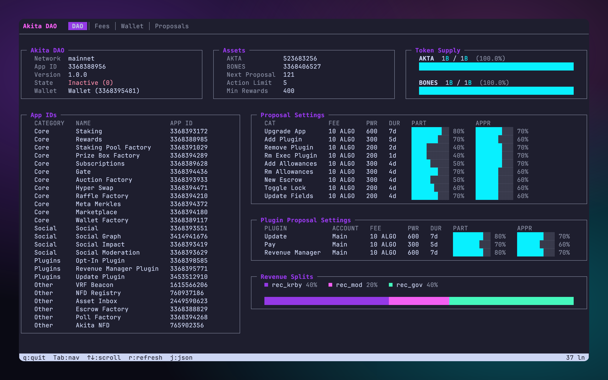
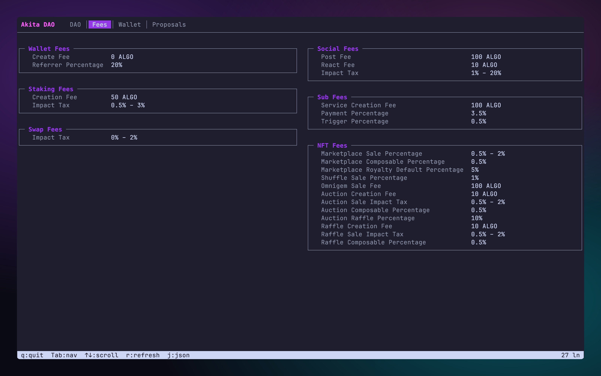
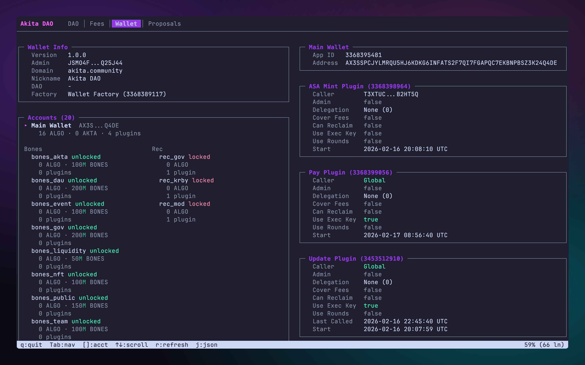
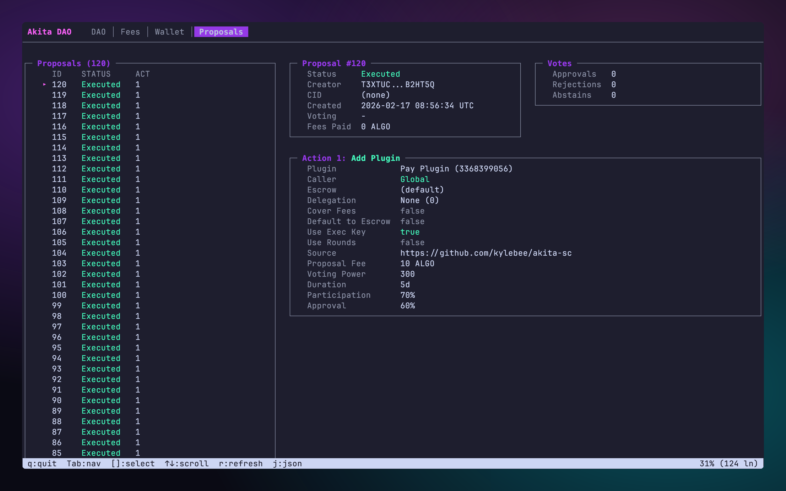

# Akita DAO CLI

A read-only CLI and interactive TUI for exploring [Akita DAO](https://akita.community) on-chain state on Algorand. Query DAO configuration, fees, proposals, wallet plugins, and more — all from your terminal.

<p align="center">
  
</p>

## Install

**One-liner** (installs [Bun](https://bun.sh) if needed):

```bash
curl -fsSL https://raw.githubusercontent.com/akita-protocol/dao-cli/main/install.sh | bash
```

**Or with npm / bun:**

```bash
npx @akta/dao-cli
bun add -g @akta/dao-cli
```

## Interactive TUI

Running `akita-dao` with no arguments launches a full-screen interactive dashboard. Navigate with keyboard shortcuts to explore every aspect of the DAO.

| Key | Action |
|-----|--------|
| `Tab` / `Shift+Tab` | Switch tabs |
| `[` `]` | Cycle items (proposals, accounts) |
| `↑` `↓` `k` `j` | Scroll |
| `PgUp` `PgDn` | Scroll fast |
| `g` / `G` | Jump to top / bottom |
| `r` | Refresh data |
| `q` | Quit |

### DAO Tab

Full DAO overview — core settings, asset supply bars, registered app IDs, proposal settings with participation/approval thresholds, and a revenue split chart.

### Fees Tab

All fee parameters across Wallet, Social, Staking, Subscription, NFT, and Swap categories displayed side-by-side.

<p align="center">
  
</p>

### Wallet Tab

DAO wallet state, escrow accounts with balances, installed plugins with method restrictions, named plugin aliases, spending allowances, and execution keys.

<p align="center">
  
</p>

### Proposals Tab

Browse and inspect governance proposals. Each proposal shows its status, vote counts, and fully decoded actions — including field updates, plugin changes, and app registrations.

<p align="center">
  
</p>

## CLI Commands

Every view in the TUI is also available as a standalone command for scripting and CI use.

### Global Options

| Flag | Description | Default |
|------|-------------|---------|
| `-n, --network <network>` | `mainnet`, `testnet`, or `localnet` | `mainnet` |
| `-j, --json` | Output as JSON | off |

### DAO

```bash
akita-dao info                        # quick dashboard
akita-dao state                       # full decoded global state
```

### Proposals

```bash
akita-dao proposals list              # all proposals, newest first
akita-dao proposals list -s active    # draft + voting only
akita-dao proposals list -s past      # rejected, approved, executed
akita-dao proposals list -l 5         # limit results
akita-dao proposals get 117           # detailed view with decoded actions
```

### Wallet

```bash
akita-dao wallet info                 # wallet global state
akita-dao wallet plugins              # installed plugins
akita-dao wallet named-plugins        # plugin aliases
akita-dao wallet escrows              # escrow accounts
akita-dao wallet allowances           # spending allowances
akita-dao wallet executions           # execution keys
akita-dao wallet balance              # ALGO, AKTA, BONES balances
akita-dao wallet balance 31566704     # specific asset
akita-dao wallet balance -e rec_gov   # escrow balance
```

### JSON Output

Add `--json` to any command for machine-readable output. BigInts are serialized as strings, byte arrays as hex.

```bash
akita-dao --json state
akita-dao --json proposals list -l 10
```

### Network Switching

```bash
akita-dao -n testnet info
akita-dao -n testnet proposals list
```

## Development

```bash
git clone https://github.com/akita-protocol/dao-cli.git
cd dao-cli
bun install
bun run src/index.ts
```

Uses [`@akta/sdk`](https://www.npmjs.com/package/@akta/sdk) from npm — installed automatically with `bun install`.

## License

MIT
